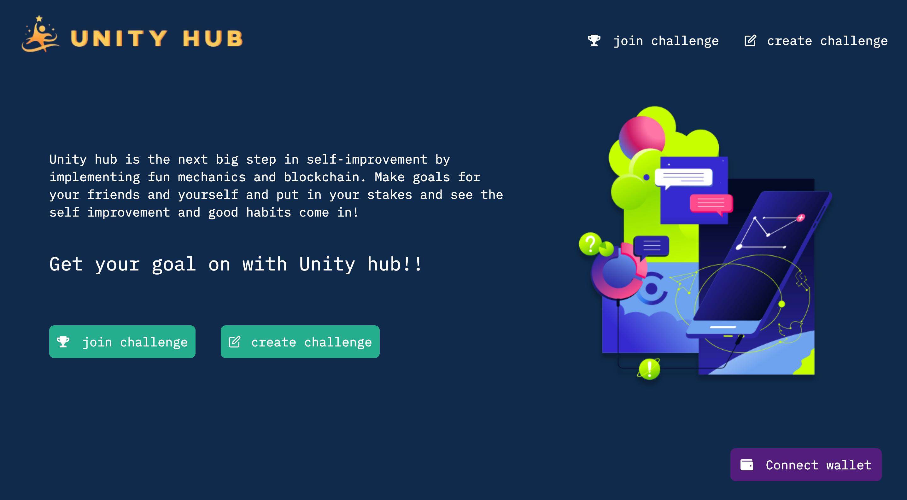
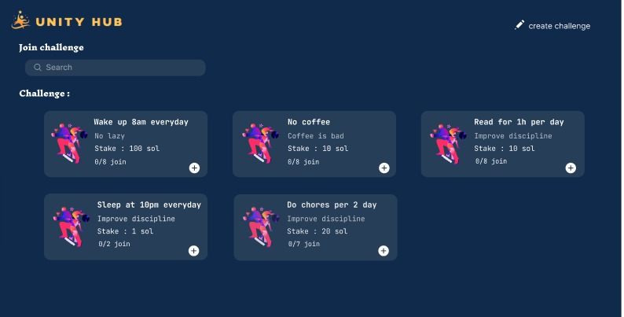
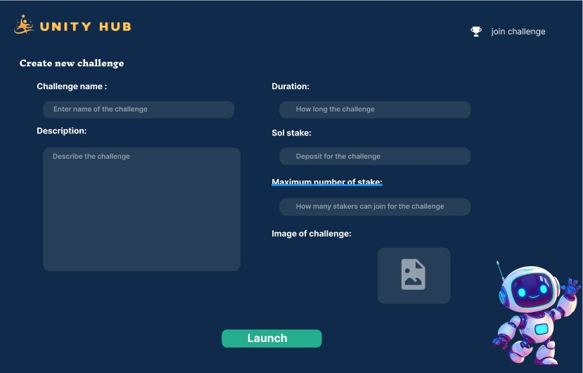
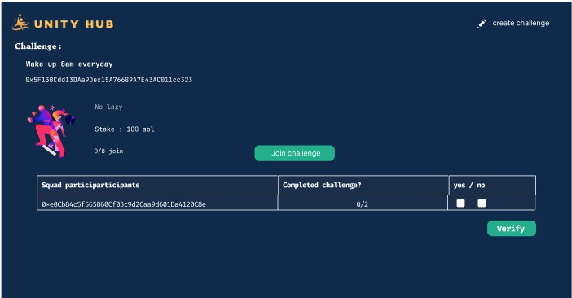
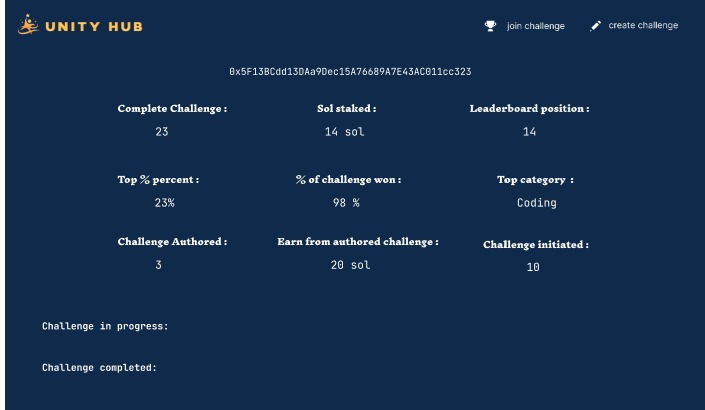

# Summary

Unity hub is the next big step in self-improvement by implementing fun mechanics and block chain. Make goals for your friends and yourself and put in your stakes and see the self improvement and good habits come in!

# How to run

### `npm intall`

### `npm start`

# How it works

1. Create a new challenge or join a challenge

2. A challenge is a 'SMART' goal (Specific, Measurable, Attainable, Relevant, Time-Bound)

3. Stake "Sol" to start the challenge

4. When the challenge deadline is met, the contract verifies for all the participants if they have succeeded or not

5. If you loose, your stake is forfeited: 10% for to challenge creator, 10% to the protocol, and the rest for the winner.

6. Earn Sol by creating challenges in the community

## Github

https://github.com/cidkagenow/unityHub-frontend

## Video demo

https://youtu.be/c_Qdhjlso84

## Pitch slides

https://tinyurl.com/UNITYHUB2024

## Twitter/X

https://twitter.com/UNITYHUB186914

## Figma design

https://tinyurl.com/UNITYHUB-figma-design

## Screen shots

### Home page

### Join challenge page

### Create challenge page

### Challenge detail

### User dashboard

